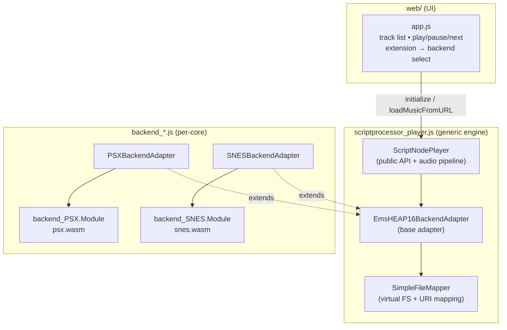

# Trackify — VGM Web Audio Player

A clean, single-page web player for Video Game Music (VGM) files. It reuses the
generic [`webaudio-player`](submodules/webaudio-player) engine together with two
Emscripten-compiled emulator cores:

| Backend | Source core | Formats | Memory |
| ------- | ----------- | ------- | ------ |
| **PSX** | [`webpsx`](submodules/webpsx) (HighlyExperimental) | `.psf` / `.minipsf` (+ `.psflib`) | 128 MB |
| **SNES** | [`websnes`](submodules/websnes) (Game Music Emu) | `.spc` | 64 MB |

The UI auto-selects the backend by file extension, decodes audio in WebAssembly,
and streams it through a `ScriptProcessorNode` pipeline.

---

## Prerequisites

The build is driven entirely by **CMake + Emscripten** (`emcmake`). You need:

- **CMake** ≥ 3.21
- **Ninja**
- **Python 3** (for the bundled emsdk and the dev HTTP server)
- **Git**
- A modern browser (Web Audio API + WebAssembly)

The Emscripten SDK lives in [`submodules/emsdk`](submodules/emsdk) and is
installed/activated as a one-time step below — no system-wide Emscripten install
is required.

---

## Building

### 0. Initialize submodules (one-time, after cloning)

This repository uses Git submodules for the emulator cores, the generic player,
and the Emscripten SDK. After cloning, populate them with:

```bash
git submodule update --init --recursive
```

To bring all submodules up to the pinned commit after a `git pull`:

```bash
git submodule update --recursive
```

---

### 1. Install & activate the Emscripten SDK (one-time)

```powershell
cd submodules/emsdk
./emsdk install latest
./emsdk activate latest
```

### 2. Load the Emscripten environment

Every build shell needs the emsdk environment on its `PATH`:

```powershell
# Windows (PowerShell)
. ./submodules/emsdk/emsdk_env.ps1
```

```bash
# Linux / macOS
source ./submodules/emsdk/emsdk_env.sh
```

Verify with `emcc --version`.

### 3. Configure & build

From the repository root:

```powershell
emcmake cmake -B build -G Ninja
cmake --build build
```

This produces everything under `build/dist/`:

```
build/dist/
├── index.html                  # UI
├── app.js
├── app.css
├── scriptprocessor_player.js   # generic player (assembled by concat)
├── backend_psx.js   + psx.wasm   # PSX backend
├── backend_snes.js  + snes.wasm  # SNES backend
├── 01 main menu.minipsf
├── driver.psflib                # PSX dependency, staged next to the minipsf
└── super james pond - codename robocod.spc
```

### 4. Serve & run

The page must be served over HTTP (WASM + `fetch` won't work from `file://`):

```powershell
cd build/dist
python -m http.server 8137
# then open http://localhost:8137/
```

`emrun build/dist/index.html` also works.

---

## Architecture



### How the pieces fit together

1. **The generic player** ([`webaudio-player`](submodules/webaudio-player)) is
   format-agnostic. `ScriptNodePlayer` owns the Web Audio pipeline and exposes
   the public API (`initialize`, `loadMusicFromURL`, `play/pause`, `getSongInfo`,
   …). It talks to a *backend adapter*.

2. **A backend adapter** (`PSXBackendAdapter`, `SNESBackendAdapter`) is a thin
   subclass of `EmsHEAP16BackendAdapter` that knows how to drive one specific
   emulator core through a small, fixed C ABI (the `emu_*` functions — load,
   teardown, compute samples, query track info, etc.).

3. **The emulator core** is the C/C++ source compiled to WebAssembly. Each core
   is wrapped in an IIFE (`backend_PSX` / `backend_SNES`) so multiple cores can
   coexist on the same page without symbol clashes.

### The `emu_*` ABI

Both cores expose the same exported C functions (PSX adds two extras). This is
the contract the adapters rely on:

```
emu_load_file, emu_teardown,
emu_compute_audio_samples, emu_get_audio_buffer, emu_get_audio_buffer_length,
emu_get_sample_rate,
emu_get_current_position, emu_seek_position, emu_get_max_position,
emu_set_subsong, emu_get_track_info,
malloc, free
# PSX only: emu_set_bios, emu_set_boost
```

### Build assembly (CMake)

Each `backend_*.js` is **assembled by concatenation** (no bundler):

```
shell-pre.js  +  <emscripten-emitted>.js  +  shell-post.js  +  <core>_adapter.js
```

- `shell-pre.js` / `shell-post.js` wrap the emitted module in the
  `backend_PSX` / `backend_SNES` IIFE and provide the async-ready hook.
- `<core>_adapter.js` is the per-core adapter subclass.

The concatenation is done by [`cmake/concat.cmake`](cmake/concat.cmake), invoked
as a post-link custom command from each backend's `CMakeLists.txt`. The generic
player is likewise assembled by concatenating the
[`webaudio-player/src`](submodules/webaudio-player/src) files in the order
defined by the upstream `build.bat` (plain concat, no minify).

> **Note:** All build logic lives in new top-level files
> ([`CMakeLists.txt`](CMakeLists.txt), [`backends/`](backends),
> [`cmake/`](cmake), [`web/`](web)). The submodule sources are never modified.

---

## Adding another backend

If a new core ships in the same shape as `webpsx` / `websnes` — i.e. an
`emscripten/` directory containing `shell-pre.js`, `shell-post.js`, a
`*_adapter.js`, glue sources, and the `emu_*` ABI — integration is mechanical.

### 1. Drop the core in

Add it under `submodules/<mycore>` with its `emscripten/` glue intact.

### 2. Create `backends/<mycore>/CMakeLists.txt`

Use [`backends/snes/CMakeLists.txt`](backends/snes/CMakeLists.txt) as the
template. The essentials:

```cmake
add_executable(mycore ${MYCORE_SOURCES})

set_target_properties(mycore PROPERTIES
    RUNTIME_OUTPUT_DIRECTORY "${CMAKE_CURRENT_BINARY_DIR}"
    OUTPUT_NAME "mycore"
    SUFFIX ".js")            # emit mycore.js (+ mycore.wasm)

target_include_directories(mycore PRIVATE ...)   # mirror makeEmscripten.bat -I flags
target_compile_definitions(mycore PRIVATE ...)   # mirror its -D defines
target_compile_options(mycore PRIVATE -O3 ...)

target_link_options(mycore PRIVATE
    "-O3" "-sWASM=1" "-sFORCE_FILESYSTEM=1"
    "-sINITIAL_MEMORY=<bytes>"
    "-sEXPORTED_FUNCTIONS=_emu_load_file,_emu_teardown,...,_malloc,_free"
    "-sEXPORTED_RUNTIME_METHODS=ccall,UTF8ToString,HEAP16,HEAPU8,HEAP32,FS_createDataFile,FS_createPath,FS_unlink")

# Assemble backend_mycore.js = shell-pre + emitted + shell-post + adapter
# (copy the add_custom_command block from an existing backend)
```

Then register it in the root [`CMakeLists.txt`](CMakeLists.txt):

```cmake
add_subdirectory(backends/mycore)
```

### 3. Wire it into the UI

In [`web/app.js`](web/app.js):

```js
const EXT_MYCORE = ['ext1', 'ext2'];
// ...in typeOf(): if (EXT_MYCORE.includes(ext)) return 'mycore';
// ...in makeAdapter(): if (type === 'mycore') return new MyCoreBackendAdapter();
```

And add `<script src="backend_mycore.js"></script>` to
[`web/index.html`](web/index.html) (after `scriptprocessor_player.js`).

### Porting checklist / gotchas

These are the things that differ from the original 2023-era `makeEmscripten.bat`
builds and tend to bite when building with a current emsdk:

- **Translate flags literally first.** Copy the include dirs (`-I…`), defines
  (`-D…`), and the `EXPORTED_FUNCTIONS` list verbatim from the core's
  `makeEmscripten.bat`. That file is the source of truth.
- **Modernize the emitted flags.** Drop `--closure 1`, `--llvm-lto`,
  `--memory-init-file`, and the `BINARYEN_*` options. Use
  `EXPORTED_RUNTIME_METHODS` (not the old `EXTRA_EXPORTED_RUNTIME_METHODS`).
- **Define `EMSCRIPTEN` yourself if the core needs it.** Modern emcc only
  defines `__EMSCRIPTEN__`. Cores that gate WASM code paths on the bare
  `EMSCRIPTEN` macro (webpsx does, for its BIOS overlays and `decode_xa` stubs)
  need `-DEMSCRIPTEN` added explicitly.
- **Export enough runtime methods.** The adapters and the file mapper touch
  `HEAP16/HEAPU8/HEAP32` and the `FS_*` helpers in addition to
  `ccall`/`UTF8ToString`. Export all of them or the adapter crashes at runtime.
- **`Pointer_stringify` shim.** Some adapters (e.g. `snes_adapter.js`) still call
  `Module.Pointer_stringify`, which modern emscripten removed. `app.js` installs
  a `Module.Pointer_stringify = UTF8ToString` shim — extend it if your adapter
  needs it too.
- **Stage dependency files.** If a format references sidecar files (PSF's
  `.psflib`), stage them next to the main file in `dist/` so the runtime file
  mapper can resolve them without a 404 (see the sample-file staging block in
  the root `CMakeLists.txt`).

---

## Project layout

```
CMakeLists.txt              # root build: backends + player + dist staging
cmake/concat.cmake          # cross-platform JS concatenation helper
backends/
  psx/CMakeLists.txt        # PSX backend build
  snes/CMakeLists.txt       # SNES backend build
web/
  index.html • app.js • app.css
sample-files/               # demo tracks
submodules/
  webaudio-player/          # generic engine (untouched)
  webpsx/                   # PSX core (untouched)
  websnes/                  # SNES core (untouched)
  emsdk/                    # Emscripten SDK
```

## License

The bundled cores and player retain their upstream licenses (GPL/LGPL — see the
respective submodule directories). All new build/UI files in this repository are
provided as integration glue.
