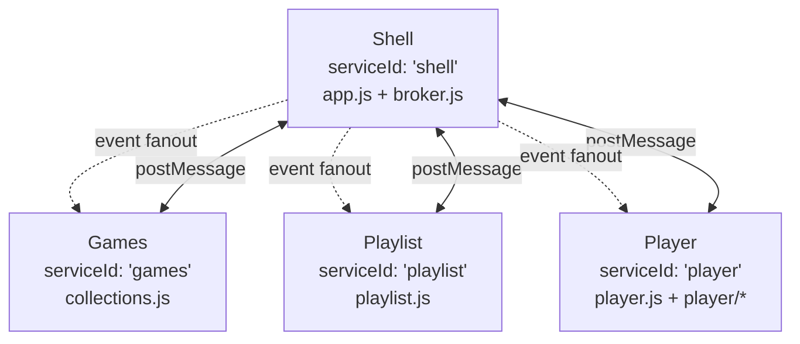

# UI Message Broker

Reference for the `postMessage`-based inter-frame communication layer
that all Trackify UI services use. The high-level UI overview (iframe
topology, app pages, PocketBase wiring) lives in the top-level
[`README.md`](../README.md); this document covers the message contract,
the broker API, and the topics currently in use.

## 1. Scope

Trackify's UI is a small iframe microservice topology. The shell hosts
two iframes that are swapped in or reused as the user navigates:

- **Shell frame** — controller + message broker. Hosts the navigation
  chrome and routes every message between services. Registers as the
  `'shell'` service (`web/app.js`).
- **Content frame** (`<iframe name="content-frame">`) — the two
  content services are swapped into this slot via
  `target="content-frame"` links:
  - `'games'` service — `collections.html` / `collections.js`. The
    games / playlists / platforms / artists grids. Speaks to the
    shell for catalog data and to the player for playback.
  - `'playlist'` service — `playlist.html` / `playlist.js`. The
    per-game / per-playlist track list and the add-to-playlist
    popup.
- **Player frame** (`<iframe id="playerFrame">`) — the `'player'`
  service. Transport controls and the Web Audio pipeline
  (`player.html`, `web/player/*.js`). Owns `ScriptNodePlayer` and the
  lazy-loaded `backend_*.js` runtimes. Loaded once and reused for
  the whole session.

All inter-frame communication is via `window.postMessage` and routed
through the shell. There is no direct frame-to-frame messaging.



## 2. The shared broker module

`web/broker.js` exports a single library used in both contexts:

```js
import { createShellBroker, createFrameBroker } from './broker.js';
```

It exposes one `TrackifyBroker` class with two factory entry points:

- `createShellBroker({ serviceId, allowedServices, allowedOrigins })`
  — owns the iframe lifecycle, validates and routes all messages, and
  implements pub/sub fanout + request correlation.
- `createFrameBroker({ serviceId, targetOrigin, requestTimeoutMs,
  allowedOrigins })` — high-level API for content/player frames. Talks
  to `window.parent` only.

The broker keeps a service registry (`shell`, `player`, `games`,
`playlist`), rejects messages from unknown services, and isolates
frames from each other. Each frame calls `createFrameBroker({ serviceId })`
once at startup; the shell learns about them either via the
`control/service.register` handshake or via `registerService()` when
the shell is the one that opens the iframe.

## 3. Message envelope

Every message that crosses the broker is wrapped in the same envelope:

```ts
type TrackifyMessage = {
  v: 1;
  id: string;                  // unique per message
  correlationId?: string;      // set on response/error to a request id
  timestamp: string;           // ISO-8601
  type: 'control' | 'event' | 'request' | 'response' | 'error';
  topic: string;
  source: 'shell' | 'player' | 'games' | 'playlist';
  target?: 'shell' | 'player' | 'games' | 'playlist' | '*';
  payload?: unknown;
  meta?: {
    timeoutMs?: number;        // request-level timeout override
  };
};
```

`PROTOCOL_VERSION` is currently `1` (`web/broker.js`). Messages whose
`v` does not match are dropped by the shell.

## 4. Routing model

1. Frames only talk to `window.parent` (the shell).
2. The shell validates `origin`, `source`, and the service allowlist.
3. The shell's behavior by envelope type:
   - `event` — fan out to subscribers.
   - `request` — route to the target service, or to a shell-local
     `handleRequest` handler.
   - `response` / `error` — resolve or reject the pending request
     identified by `correlationId`.
4. No direct frame-to-frame messaging.

Frames register themselves with the shell using the `control/...`
topic family:

- `control/service.register` — frame → shell, registers the service id
  and its `contentWindow`.
- `control/service.ready` — shell → frame, signals that the shell is
  ready to route messages.
- `control/service.subscriptions.update` — frame → shell, updates the
  set of topics the frame wants to receive.

The shell auto-replies with `control/service.ready` and the frame
retries `control/service.register` until it has been acknowledged.

## 5. Broker API

Both factory entry points return a broker with the same surface:

```js
const broker = createFrameBroker({
  serviceId: 'games',         // 'shell' | 'player' | 'games' | 'playlist'
  targetOrigin: window.location.origin,
  requestTimeoutMs: 4000,
  allowedOrigins: [window.location.origin],
});

broker.start();
broker.destroy();

broker.subscribe(topic, handler);
broker.publish(topic, payload, options?);   // { target, ... }
broker.request(topic, payload, options?);   // Promise; resolves on response, rejects on error/timeout
broker.handleRequest(topic, async ({ payload }) => result);   // shell only
broker.registerService(serviceId, frameWindow, options?);     // shell only
broker.routeRequestTopic(topic, serviceId);                  // shell only — route a request topic directly to a frame service instead of a shell-local handler
```

The `target` option in `publish` / `request` accepts a single service
id, an array of service ids, or `'*'` for fanout. `subscribe` handlers
are invoked with `{ payload, meta, message }`.

The shell additionally uses `allowedServices` and `allowedOrigins`
allowlists to drop messages that don't match — these are the security
baseline of the protocol.

## 6. Topics in use

The shell currently defines the following service allowlist
(`web/app.js`):

```js
allowedServices: ['player', 'playlist', 'games']
```

The actual topic traffic, organized by direction:

### Shell-local request handlers

| Topic                       | Requested by | Purpose                                            |
| --------------------------- | ------------ | -------------------------------------------------- |
| `shell.queryIndex`          | content      | tracks for a game (or all). Accepts `{ game }`, `{ artist }`, `{ title }` (title-only LIKE), or `{ q }` (case-insensitive substring across `title`, `game`, `artist`, sorted by title). |
| `shell.queryGames`          | content      | games list, optionally filtered by id / platform   |
| `shell.queryArtists`        | content      | artists list, optionally filtered by name          |
| `shell.queryPlaylists`      | content      | playlists list, filtered by `type` (default `public`). `type=own` returns every playlist the current user owns except the row with `type="favorites"` (the favorites playlist has its own dedicated hero/link and is never surfaced in a grid). |
| `shell.queryPlaylistsForTrack` | content   | playlist ids owned by the current user that already contain a given track |
| `shell.addTrackToPlaylist`  | content      | append a track to a playlist owned by the current user |
| `shell.removeTrackFromPlaylist` | content | remove a track from a playlist owned by the current user |
| `shell.queryPlaylist`       | content      | single playlist by `id` + its tracks               |
| `shell.createPlaylist`      | content      | create a private playlist for the current user     |
| `shell.updatePlaylist`      | content      | update an owned playlist (currently: title only)   |
| `shell.queryFavorites`      | content      | current user's favorites playlist                  |
| `shell.queryUser`           | content      | current PocketBase auth state + user record        |

### Shell → content/player

| Topic                | Type   | Purpose                                            |
| -------------------- | ------ | -------------------------------------------------- |
| `playlist.selected`  | event  | tells the player which playlist to load + autoplay  |
| `shell.favorites.changed` | event | shell-initiated favorites toggle fanout so the playlist frame's favorites Set stays live; payload `{ trackId, isFavorite }`; target `*` |
| `player.toggle`      | event  | toggles play/pause (used by media key fallback)    |
| `player.play`        | event  | play current/selected                              |
| `player.pause`       | event  | pause playback                                     |
| `player.next`        | event  | next track                                         |
| `player.prev`        | event  | previous track                                     |
| `player.shuffle.toggle` | event | toggle shuffle on/off                           |
| `player.seek.relative` | event | `{ seconds }` delta seek (signed)                |
| `player.seek.absolute` | event | `{ seconds }` absolute seek                       |
| `shell.content.rerender` | event | tell a content frame to re-parse its URL hash and re-render after a same-document `location.replace`; payload `{ href }`; published by `applyRouteToContentFrame` with `target: 'games' \| 'playlist'` (see [`docs/router.md` §6](router.md#6-iframe-navigation-sync--the-shell-only-history-model)) |

### Frame → shell

| Topic                       | Type   | Purpose                                            |
| --------------------------- | ------ | -------------------------------------------------- |
| `player.ready`              | event  | player frame has finished init                     |
| `player.trackChanged`       | event  | current track / index changed                      |
| `player.stateChanged`       | event  | playback state changed                             |
| `player.mediaSessionSync`   | event  | media-session metadata + position + capabilities   |
| `playlist.liked`            | event  | user added a track to favorites                    |
| `playlist.unliked`          | event  | user removed a track from favorites                |
| `shell.user.login`          | event  | PocketBase auth state became valid                 |
| `shell.user.logout`         | event  | PocketBase auth state became invalid               |
| `shell.navigation.requested`| event  | frame requests a shell-side navigation (see [`docs/frontend.md`](frontend.md#7-router-and-data-router-link)) |

### Frame request handlers

Frame-to-frame requests are sent with `target: '<service-id>'`; the shell
routes them to the target frame, where `broker.handleRequest(...)` answers
them. They never hit a shell-local handler.

| Topic                       | Requested by | Handled by | Purpose                                            |
| --------------------------- | ------------ | ---------- | -------------------------------------------------- |
| `player.getCurrentPlaylist` | playlist     | player     | snapshot of the player's current queue + active track id; lets the playlist frame highlight the right row on initial load instead of waiting for the next `player.stateChanged` |

## 7. `playlist.selected` payload

The `playlist.selected` event is the canonical handoff from the content
frame (or the shell's favorites flow) to the player frame. Its
payload shape:

```ts
type PlaylistSelectedEventPayload = {
  source: string;               // informational origin tag; in use today:
                                //   'sample-files/index.json' — game flow (collections play button)
                                //   'playlist:<id>'         — user playlist flow (standalone page + collections play button)
                                //   'favorites'             — PocketBase favorites playlist
  selectedIndex: number;        // -1 when the playlist is empty; otherwise the player
                                //   clamps to [0, tracks.length-1] so publishers can send
                                //   the natural index without bounds checks
  tracks: Array<{
    id: string;                 // shell-assigned stable id, e.g. 'sample-0'
    title: string;
    file: string;               // backend-resolvable track URL/path
    platform: string;           // 'psx' | 'snes' | 'nez' | 'n64' | 'vgm' | 'xa' | 'genh' | 'mp3'
    game: string;               // display name of the game
    gameId: string;             // PocketBase record id of the game
    artist: string;             // joined artist string (multi-artist supported upstream)
    coverArt: string;           // absolute or relative cover-art URL
  }>;
  autoplay?: boolean;           // if true, the player starts immediately
};
```

The `file` field must be resolvable from the player frame's origin.
For PocketBase-backed tracks, the shell rewrites it to
`/api/files/games/<gameId>/` (see
`ShellCatalogService#resolveFilename` in `web/catalog_service.js`).

The player drops any track that is missing `title` or `file` before
applying `selectedIndex`, so publishers can hand the raw response from
`shell.queryPlaylist` straight through without re-filtering.

## 7.1. `shell.queryPlaylist` payload

The content frame calls `shell.queryPlaylist` with `{ id }` to load a
single playlist by its PocketBase record id. The shell responds with
the playlist metadata and its tracks in `playlist_tracks_view` order:

```ts
type QueryPlaylistRequest = {
  id: string;                    // PocketBase record id of the playlists row
};

type QueryPlaylistResponse = {
  tracks: PlaylistTrackEntry[];  // same shape as `playlist.selected.tracks`
  playlist: {
    id: string;
    title: string;
    type: 'private' | 'public' | 'favorites';
  } | null;
  error: string;                 // '' on success; 'Playlist not found' / load error otherwise
};
```

The response reuses the same track entry shape as `playlist.selected`,
so the content frame can hand the response straight to the existing
`handleIndexLoaded` pipeline. Access respects the PocketBase `playlists`
list rule (`type='public' || @request.auth.id = user.id`); an
unauthorised id resolves to `error: 'Playlist not found'`.

### Caller contract (catch-and-resolve)

`shell.queryPlaylist` is **catch-and-resolve**, not throw-on-error. The
broker promise resolves with `{ tracks: [], playlist: null, error: '...' }`
for both "row not found" and "permission denied" (PocketBase returns 404
in both cases because of the `viewRule`/`listRule`), and for any
transport-level error (`error: 'Error loading playlist (see console)'`).
The promise only rejects when the broker itself fails (timeout, shell
not ready, decode failure).

Callers must therefore treat `payload.error` as the primary failure
signal and short-circuit before publishing — a bare `try { … } catch {… }`
will not catch the not-found / not-allowed cases. The right pattern is:

```js
const payload = await broker.request('shell.queryPlaylist', { id }, …);
if (payload?.error) { setStatus(payload.error); return; }
if (!payload.tracks.length) { setStatus('Empty playlist'); return; }
// safe to publish payload.tracks to 'playlist.selected' now
```

## 7.2. `shell.updatePlaylist` payload

The content frame calls `shell.updatePlaylist` to mutate a playlist it
owns. The shell forwards it to `ShellCatalogService#updatePlaylist`,
which validates input, rejects empty / reserved titles (`'__fav__'`),
and writes through the PocketBase `playlists` collection. PocketBase
enforces ownership via the collection's `updateRule`
(`@request.auth.id != '' && @request.auth.id = user.id`), so the
content frame should only surface the edit affordance for playlists
where `playlist.userId === currentUser.id` and `playlist.type !== 'favorites'`.

```ts
type UpdatePlaylistRequest = {
  id: string;                    // PocketBase record id of the playlist
  updates: {
    title?: string;              // trimmed; must be non-empty and not '__fav__'
    color?: string;              // CSS hex color, must match `#rrggbb`
    icon?: string;               // Material Symbols ligature; must be in PLAYLIST_MUSIC_ICONS
    type?: 'private' | 'public'; // visibility; 'favorites' is reserved and rejected
  };
};

type UpdatePlaylistResponse = {
  id: string;
  title: string;
  type: 'private' | 'public' | 'favorites';
  userId: string;
  color: string;
  icon: string;
};
```

Failures reject with a `request_failed` error whose `message` is
`'Playlist not found'`, `'Title cannot be empty'`, `'Title is reserved'`,
`'Invalid playlist color'`, `'Invalid playlist icon'`, `'Invalid playlist type'`,
or `'Failed to update playlist'` depending on the failure mode.

## 7.3. `shell.navigation.requested` payload

Frames publish this event to ask the shell's `Router`
(`web/router.js`) to navigate. The shell resolves the URL against its
registered route table, pushes history, and drives the
`#playlistFrame` swap (see
[`docs/frontend.md`](frontend.md#7-router-and-data-router-link)).
Frames never call `window.location.assign` directly.

```ts
type NavigationRequestedPayload = {
  request: string | NavigationToken;
  options?: {
    replace?: boolean;
    meta?: Record<string, unknown>;
  };
};

type NavigationToken =
  | { token: 'back' }
  | { token: 'forward' }
  | { token: 'go'; delta: number };
```

A `string` request is a virtual shell URL (e.g. `/playlists/<id>`); a
`NavigationToken` triggers a `history.back()` / `forward()` /
`history.go(delta)` on the shell side. `meta` is forwarded to the
router's `navigated` subscribers — it does not affect routing.

Frames publish this event via `createNavClient({ broker })` from
`web/nav_client.js`; the shell subscribes directly to the topic in
`web/app.js#initRouter`.

## 7.4. `shell.content.rerender` payload

After the shell calls `frame.contentWindow.location.replace(next)` on a
same-document navigation (e.g. `/games` → `/playlists`, both targeting
`/collections.html` with different query strings), the iframe's URL is
updated but neither `hashchange` nor `popstate` fires. The shell
publishes this event so the iframe can re-parse its own hash and
re-render to match the new URL.

```ts
type ContentRerenderEventPayload = {
  href: string;          // absolute URL the iframe was just replaced to
};
```

The shell publishes with `target: 'games' | 'playlist'` (derived from
the route's `target.html` via `serviceIdForHtml` in
`web/app.js#applyRouteToContentFrame`). The receiving frame's
subscriber simply re-runs its route parser:

```js
// web/collections.js init()
broker.subscribe(CONTENT_RERENDER_TOPIC, () => applyRoute());

// web/playlist.js bindBrokerHandlers()
broker.subscribe(CONTENT_RERENDER_TOPIC, () => evaluateFragmentParameters());
```

Full reference for the shell-only-history model (why the iframe can't
just observe its own URL change) is in
[`docs/router.md` §6](router.md#6-iframe-navigation-sync--the-shell-only-history-model).

## 7.5. `player.getCurrentPlaylist` payload

The playlist frame sends this request to the player frame (via the
shell) right after `applyIndexPayload` and on `player.ready`, so the
highlighted row in the track list matches the player's active track
from the first paint — without waiting for the next
`player.stateChanged`. The player answers synchronously from
`transport.getCurrentPlaylist()`; the playlist then matches the
player's `source` against its own `playlistInfo.source` and the
player's `currentTrack` id against a local track row, only updating
`currentIndex` when both match (so navigating to a different
playlist never relocates the highlight to an unrelated track).

```ts
type GetCurrentPlaylistRequest = {
  // intentionally empty — the snapshot is whatever the player has loaded
};

type GetCurrentPlaylistResponse = {
  source: string;               // mirrors `playlist.selected.source`; '' when
                                //   the player has no queue loaded
  tracks: Array<{                // mirrors `playlist.selected.tracks`
    id: string;
    title: string;
    file: string;
    platform: string;
    game: string;
    gameId: string;
    artist: string;
    coverArt: string;
  }>;
  selectedIndex: number;        // player's current index; -1 when the queue
                                //   is empty
  currentTrack: string | null;  // id of the player's current track; null
                                //   when `selectedIndex < 0` or the row
                                //   has no string `id`
};
```

The request is `catch-and-ignore`: errors (player not registered, not
ready, request timeout) are swallowed on the playlist side. There is
no retry — a subsequent `player.stateChanged` will keep the
highlight in sync if the response never lands.

## 8. Adding a new topic

1. Pick a topic name in the existing namespace
   (`<service>.<verb>` for events, `<service>.<query>` for requests,
   `control/...` for broker control).
2. Decide on direction and which side subscribes / handles.
3. If it crosses the shell, add the new topic to the
   `allowedServices` allowlist only if you are also introducing a new
   service id (the broker routes by service, not by topic).
4. Decide where the request is handled:
   - Shell-local handler — `shellBroker.handleRequest(...)` in
     `web/app.js#initBroker`.
   - Forwarded to another frame — `shellBroker.routeRequestTopic(...)`
     so the shell routes incoming requests of that topic straight to
     the target service instead of a shell-local handler.
   - Frame-side handler — `broker.handleRequest(...)` in the target
     frame (e.g. `web/player.js#bindBrokerHandlers`). The request is
     sent with `target: '<service-id>'`; the shell routes it to the
     frame and the frame's handler answers.
   - Subscribe to the event on the receiving side.
5. Document the payload in this file.

### PocketBase `pb.filter()` parameter format

`pb.filter(template, params)` (PocketBase JS SDK ≥ 0.21) substitutes
`{:<key>}` placeholders by wrapping values based on their JS type:

- `string` → wrapped in single quotes, e.g. `Chrono` becomes `'Chrono'`.
- `number` / `boolean` → bare literal.
- anything else → `null` / ISO date / `'JSON.stringify(value)'`.

Passing a `JSON.stringify(...)`-wrapped string — e.g.
`pb.filter('title~{:p}', { p: JSON.stringify('Chrono') })` — produces
`title~'"Chrono"'` (single quotes added by the SDK *around* the
double-quote literal), which PocketBase parses as `LIKE '"Chrono"'`
and matches nothing. Always pass the raw string:

```js
pb.filter('title~{:pattern}', { pattern: trimmed })  // -> title~'Chrono'
```

The SDK also escapes single quotes inside string values
(`'` → `\\'`), so track titles containing an apostrophe are safe.

### Shell-local handlers can only be called from a frame

`shellBroker.handleRequest(topic, fn)` is invoked by the shell when a
*frame* posts a request with `target: 'shell'` (see
`web/broker.js#handleShellRequest`). The broker resolves the target
window via `resolveTargetWindow`, which returns `null` for
`target === 'shell'` (the shell is not a registered iframe service in
its own registry) — so shell-side code calling
`shellBroker.request('shell.queryIndex', payload, { target: 'shell' })`
throws `Cannot resolve target window for message topic: <topic>`
(`web/broker.js:396`).

When the shell itself needs the data behind a `shell.queryXxx`
handler — e.g. `web/shell/search.js` powering the top-bar search
popover — call `ShellCatalogService` (or whichever shell-local object
backs the handler) directly. Bypassing the broker for shell-internal
callers avoids the self-routing trap and saves a postMessage round
trip. Frames keep using `broker.request('shell.<topic>', ...)` exactly
as they do today.

## 9. Security baseline

- Use an explicit `targetOrigin` (avoid `'*'` outside local dev).
- The shell validates `origin`, `source`, and the service allowlist
  for every inbound message.
- Unknown protocol versions or malformed envelopes are dropped.
- Restrict request topics by service where needed (e.g.
  `shell.queryUser` is only meaningful from authenticated content
  frames).
