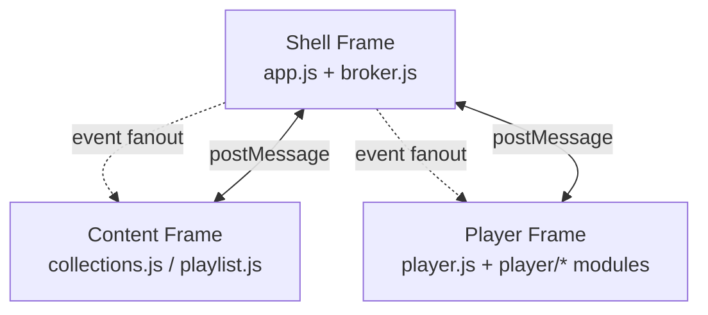

# UI Message Broker

Reference for the `postMessage`-based inter-frame communication layer
that all Trackify UI services use. The high-level UI overview (iframe
topology, app pages, PocketBase wiring) lives in the top-level
[`README.md`](../README.md); this document covers the message contract,
the broker API, and the topics currently in use.

## 1. Scope

Trackify's UI is a small iframe microservice topology:

- **Shell frame** — controller + message broker. Hosts the navigation
  chrome and routes every message between services.
- **Content frame** — content-domain UI (currently `collections.html`
  and `playlist.html`). Speaks to the shell for catalog data and to
  the player for playback.
- **Player frame** — transport controls and the Web Audio pipeline
  (`player.html`). Owns `ScriptNodePlayer` and the lazy-loaded
  `backend_*.js` runtimes.

All inter-frame communication is via `window.postMessage` and routed
through the shell. There is no direct frame-to-frame messaging.



## 2. The shared broker module

`web/broker.js` exports a single library used in both contexts:

```js
import { createShellBroker, createFrameBroker } from './broker.js';
```

It exposes one `TrackifyBroker` class with two factory entry points:

- `createShellBroker({ serviceId, allowedServices, allowedOrigins })`
  — owns the iframe lifecycle, validates and routes all messages, and
  implements pub/sub fanout + request correlation.
- `createFrameBroker({ serviceId, targetOrigin, requestTimeoutMs,
  allowedOrigins })` — high-level API for content/player frames. Talks
  to `window.parent` only.

The broker keeps a service registry (`shell`, `content`, `player`,
`games`, `playlist`), rejects messages from unknown services, and
isolates frames from each other.

## 3. Message envelope

Every message that crosses the broker is wrapped in the same envelope:

```ts
type TrackifyMessage = {
  v: 1;
  id: string;                  // unique per message
  correlationId?: string;      // set on response/error to a request id
  timestamp: string;           // ISO-8601
  type: 'control' | 'event' | 'request' | 'response' | 'error';
  topic: string;
  source: 'shell' | 'content' | 'player' | 'games' | 'playlist';
  target?: 'shell' | 'content' | 'player' | 'games' | 'playlist' | '*';
  payload?: unknown;
  meta?: {
    timeoutMs?: number;        // request-level timeout override
  };
};
```

`PROTOCOL_VERSION` is currently `1` (`web/broker.js`). Messages whose
`v` does not match are dropped by the shell.

## 4. Routing model

1. Frames only talk to `window.parent` (the shell).
2. The shell validates `origin`, `source`, and the service allowlist.
3. The shell's behavior by envelope type:
   - `event` — fan out to subscribers.
   - `request` — route to the target service, or to a shell-local
     `handleRequest` handler.
   - `response` / `error` — resolve or reject the pending request
     identified by `correlationId`.
4. No direct frame-to-frame messaging.

Frames register themselves with the shell using the `control/...`
topic family:

- `control/service.register` — frame → shell, registers the service id
  and its `contentWindow`.
- `control/service.ready` — shell → frame, signals that the shell is
  ready to route messages.
- `control/service.subscriptions.update` — frame → shell, updates the
  set of topics the frame wants to receive.

The shell auto-replies with `control/service.ready` and the frame
retries `control/service.register` until it has been acknowledged.

## 5. Broker API

Both factory entry points return a broker with the same surface:

```js
const broker = createFrameBroker({
  serviceId: 'content',
  targetOrigin: window.location.origin,
  requestTimeoutMs: 4000,
  allowedOrigins: [window.location.origin],
});

broker.start();
broker.destroy();

broker.subscribe(topic, handler);
broker.publish(topic, payload, options?);   // { target, ... }
broker.request(topic, payload, options?);   // Promise; resolves on response, rejects on error/timeout
broker.handleRequest(topic, async ({ payload }) => result);   // shell only
broker.registerService(serviceId, frameWindow, options?);     // shell only
```

The `target` option in `publish` / `request` accepts a single service
id, an array of service ids, or `'*'` for fanout. `subscribe` handlers
are invoked with `{ payload, meta, message }`.

The shell additionally uses `allowedServices` and `allowedOrigins`
allowlists to drop messages that don't match — these are the security
baseline of the protocol.

## 6. Topics in use

The shell currently defines the following service allowlist
(`web/app.js`):

```js
allowedServices: ['player', 'playlist', 'games']
```

The actual topic traffic, organized by direction:

### Shell-local request handlers

| Topic                  | Requested by | Purpose                                            |
| ---------------------- | ------------ | -------------------------------------------------- |
| `shell.queryIndex`     | content      | tracks for a game (or all)                         |
| `shell.queryGames`     | content      | games list, optionally filtered by id / platform   |
| `shell.queryArtists`   | content      | artists list, optionally filtered by name          |
| `shell.queryPlaylists` | content      | playlists list, filtered by `type` (default `public`) |
| `shell.queryPlaylist`  | content      | single playlist by `id` + its tracks               |
| `shell.createPlaylist` | content      | create a private playlist for the current user     |
| `shell.updatePlaylist` | content      | update an owned playlist (currently: title only)   |
| `shell.queryFavorites` | content      | current user's favorites playlist                  |
| `shell.queryUser`      | content      | current PocketBase auth state + user record        |

### Shell → content/player

| Topic                | Type   | Purpose                                            |
| -------------------- | ------ | -------------------------------------------------- |
| `playlist.selected`  | event  | tells the player which playlist to load + autoplay  |
| `player.toggle`      | event  | toggles play/pause (used by media key fallback)    |
| `player.play`        | event  | play current/selected                              |
| `player.pause`       | event  | pause playback                                     |
| `player.next`        | event  | next track                                         |
| `player.prev`        | event  | previous track                                     |
| `player.shuffle.toggle` | event | toggle shuffle on/off                           |
| `player.seek.relative` | event | `{ seconds }` delta seek (signed)                |
| `player.seek.absolute` | event | `{ seconds }` absolute seek                       |

### Frame → shell

| Topic                       | Type   | Purpose                                            |
| --------------------------- | ------ | -------------------------------------------------- |
| `player.ready`              | event  | player frame has finished init                     |
| `player.trackChanged`       | event  | current track / index changed                      |
| `player.stateChanged`       | event  | playback state changed                             |
| `player.mediaSessionSync`   | event  | media-session metadata + position + capabilities   |
| `playlist.liked`            | event  | user added a track to favorites                    |
| `playlist.unliked`          | event  | user removed a track from favorites                |
| `shell.user.login`          | event  | PocketBase auth state became valid                 |
| `shell.user.logout`         | event  | PocketBase auth state became invalid               |

## 7. `playlist.selected` payload

The `playlist.selected` event is the canonical handoff from the content
frame (or the shell's favorites flow) to the player frame. Its
payload shape:

```ts
type PlaylistSelectedEventPayload = {
  source: string;               // e.g. 'tracks/index.json' or 'favorites'
  selectedIndex: number;        // -1 when the playlist is empty
  tracks: Array<{
    id: string;                 // shell-assigned stable id, e.g. 'sample-0'
    title: string;
    file: string;               // backend-resolvable track URL/path
    platform: string;           // 'psx' | 'snes' | 'nez' | 'n64' | 'vgm' | 'xa' | 'genh' | 'mp3'
    game: string;               // display name of the game
    gameId: string;             // PocketBase record id of the game
    artist: string;             // joined artist string (multi-artist supported upstream)
    coverArt: string;           // absolute or relative cover-art URL
  }>;
  autoplay?: boolean;           // if true, the player starts immediately
};
```

The `file` field must be resolvable from the player frame's origin.
For PocketBase-backed tracks, the shell rewrites it to
`/api/files/games/<gameId>/` (see
`ShellCatalogService#resolveFilename` in `web/catalog_service.js`).

## 7.1. `shell.queryPlaylist` payload

The content frame calls `shell.queryPlaylist` with `{ id }` to load a
single playlist by its PocketBase record id. The shell responds with
the playlist metadata and its tracks in `playlist_tracks_view` order:

```ts
type QueryPlaylistRequest = {
  id: string;                    // PocketBase record id of the playlists row
};

type QueryPlaylistResponse = {
  tracks: PlaylistTrackEntry[];  // same shape as `playlist.selected.tracks`
  playlist: {
    id: string;
    title: string;
    type: 'private' | 'public' | 'favorites';
  } | null;
  error: string;                 // '' on success; 'Playlist not found' / load error otherwise
};
```

The response reuses the same track entry shape as `playlist.selected`,
so the content frame can hand the response straight to the existing
`handleIndexLoaded` pipeline. Access respects the PocketBase `playlists`
list rule (`type='public' || @request.auth.id = user.id`); an
unauthorised id resolves to `error: 'Playlist not found'`.

## 7.2. `shell.updatePlaylist` payload

The content frame calls `shell.updatePlaylist` to mutate a playlist it
owns. The shell forwards it to `ShellCatalogService#updatePlaylist`,
which validates input, rejects empty / reserved titles (`'__fav__'`),
and writes through the PocketBase `playlists` collection. PocketBase
enforces ownership via the collection's `updateRule`
(`@request.auth.id != '' && @request.auth.id = user.id`), so the
content frame should only surface the edit affordance for playlists
where `playlist.userId === currentUser.id` and `playlist.type !== 'favorites'`.

```ts
type UpdatePlaylistRequest = {
  id: string;                    // PocketBase record id of the playlist
  updates: {
    title?: string;              // trimmed; must be non-empty and not '__fav__'
  };
};

type UpdatePlaylistResponse = {
  id: string;
  title: string;
  type: 'private' | 'public' | 'favorites';
  userId: string;
};
```

Failures reject with a `request_failed` error whose `message` is
`'Playlist not found'`, `'Title cannot be empty'`, `'Title is reserved'`,
or `'Failed to update playlist'` depending on the failure mode.

## 8. Adding a new topic

1. Pick a topic name in the existing namespace
   (`<service>.<verb>` for events, `<service>.<query>` for requests,
   `control/...` for broker control).
2. Decide on direction and which side subscribes / handles.
3. If it crosses the shell, add the new topic to the
   `allowedServices` allowlist only if you are also introducing a new
   service id (the broker routes by service, not by topic).
4. Add the new request handler on the shell with
   `shellBroker.handleRequest(...)` in `web/app.js#initBroker`, or
   subscribe to the event on the receiving side.
5. Document the payload in this file.

## 9. Security baseline

- Use an explicit `targetOrigin` (avoid `'*'` outside local dev).
- The shell validates `origin`, `source`, and the service allowlist
  for every inbound message.
- Unknown protocol versions or malformed envelopes are dropped.
- Restrict request topics by service where needed (e.g.
  `shell.queryUser` is only meaningful from authenticated content
  frames).
