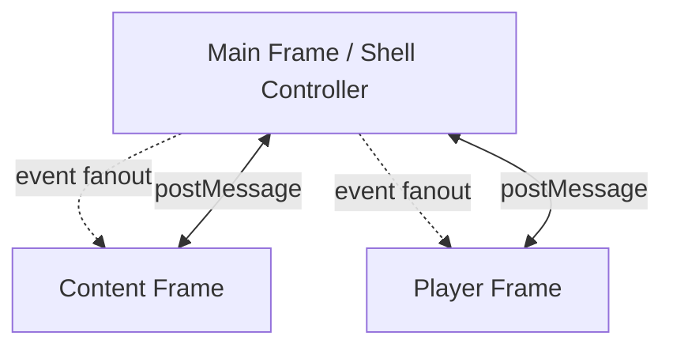

# Trackify UI Architecture (Draft v0.2)

## 1. Scope

Initial iframe microservice topology:

- Main Frame (Shell): controller + message broker
- Content Frame: catalog, browsing, track selection
- Player Frame: transport controls and playback state

All communication is based on `window.postMessage` and routed through the shell.

## 2. High-Level Architecture



### 2.1 Main Frame (Shell)

- Owns iframe lifecycle and registration.
- Maintains service registry (`content`, `player`).
- Validates and routes all messages.
- Implements pub/sub fanout and request correlation.

### 2.2 Content Frame

- Publishes content-domain events (example: `content.trackSelected`).
- Requests data/state from shell or other services via shell broker.
- Subscribes to player events if needed (example: `player.stateChanged`).

### 2.3 Player Frame

- Publishes playback events (`player.stateChanged`, `playlist.finished`).
- Handles playback requests (example: `player.playTrack`).
- Subscribes to content events (example: `content.trackSelected`).

## 3. Message Contract

```ts
type TrackifyMessage = {
  v: 1;
  id: string;
  correlationId?: string;
  timestamp: string;
  type: 'control' | 'event' | 'request' | 'response' | 'error';
  topic: string;
  source: 'shell' | 'content' | 'player';
  target?: 'shell' | 'content' | 'player' | '*';
  payload?: unknown;
  meta?: {
    timeoutMs?: number;
  };
};
```

### 3.1 Topic Conventions

- Events:
  - `content.trackSelected`
  - `player.stateChanged`
  - `playlist.finished`
- Requests:
  - `content.getTracksForGame`
  - `player.playTrack`
  - `player.pause`
- Responses:
  - Same `topic` as request or explicit result topic.
  - Must include `correlationId`.

## 4. Routing Model

1. Frame -> Shell only (`window.parent.postMessage`).
2. Shell validates message shape and sender.
3. Shell behavior:
   - `event`: fanout to subscribers.
   - `request`: route to target service or shell-local handler.
   - `response`/`error`: resolve/reject pending request by `correlationId`.
4. No direct frame-to-frame communication.

## 5. Lifecycle

1. Frame bootstraps `broker.js` in frame mode.
2. Frame sends `control/service.register`.
3. Shell sends `control/service.ready`.
4. Frame updates subscriptions with `control/service.subscriptions.update`.

## 6. Shared Library: broker.js

Use a single shared module at `web/broker.js` in both shell and frame contexts.

### 6.1 High-Level API

```js
import {
  createShellBroker,
  createFrameBroker,
} from './broker.js';

// Shell
const shellBroker = createShellBroker({
  serviceId: 'shell',
  allowedServices: ['content', 'player'],
  allowedOrigins: [window.location.origin],
});

// Frame (example: content)
const contentBroker = createFrameBroker({
  serviceId: 'content',
  targetOrigin: window.location.origin,
  requestTimeoutMs: 4000,
});
```

Supported operations:

- `start()` / `destroy()`
- `subscribe(topic, handler)`
- `publish(topic, payload, options?)`
- `request(topic, payload, options?)` -> Promise
- `handleRequest(topic, handler)`
- `registerService(serviceId, frameWindow, options?)` (shell only)

### 6.2 Event Example

```js
// Content frame emits selected track
contentBroker.publish('content.trackSelected', {
  trackId: 'oot-001',
  gameId: 'zelda-oot',
});

// Player frame reacts
playerBroker.subscribe('content.trackSelected', async ({ payload }) => {
  await playerBroker.request('player.playTrack', payload, { target: 'player' });
});
```

### 6.3 Request/Response Example

```js
// Content asks for tracks
const result = await contentBroker.request(
  'content.getTracksForGame',
  { gameId: 'zelda-oot' },
  { target: 'shell', timeoutMs: 3000 }
);

// result = response.payload
```

## 7. Security Baseline

- Use explicit `targetOrigin` (avoid `*` outside local dev).
- Validate `origin`, `source`, and service allowlist in shell.
- Reject unknown message versions or malformed envelopes.
- Restrict request topics by service where needed.
